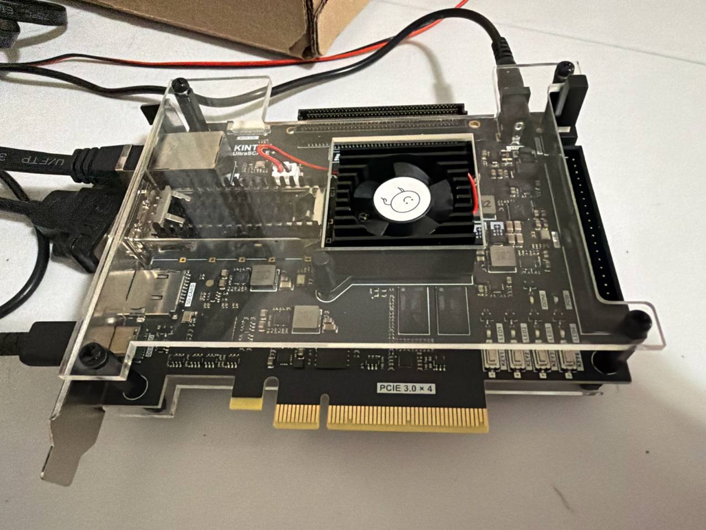
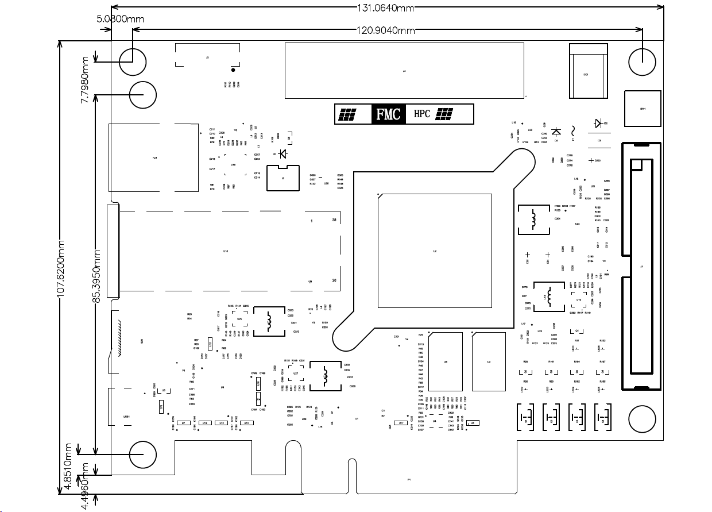
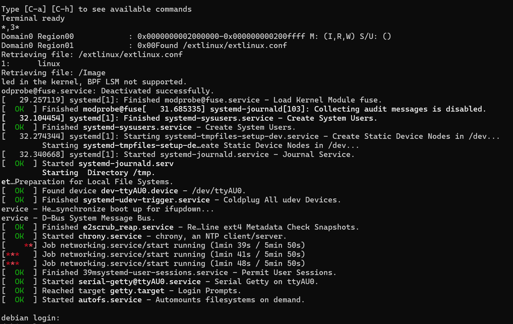
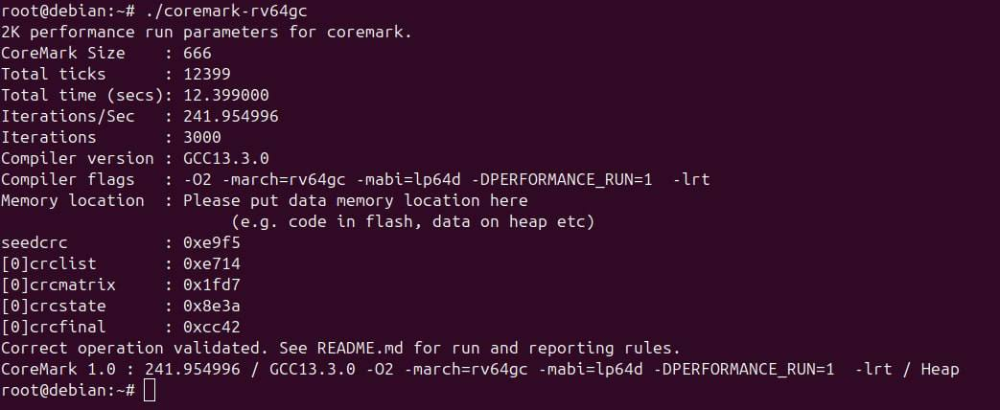
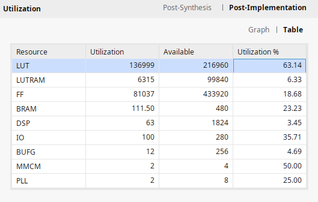
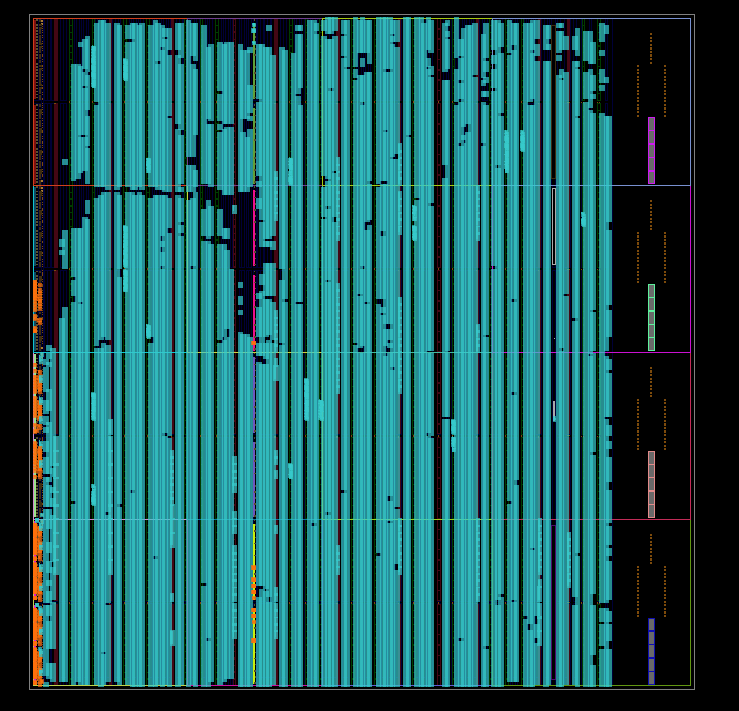

# RISC-V Linux SoC — RIGUKE RK-XCKU5P-F

A 4-core RV64GC RISC-V Linux server (Rocket Chip) for the **RIGUKE RK-XCKU5P-F V1.2** board.
Runs Debian from a MicroSD card with Gigabit Ethernet, UART console, and 2 GB DDR4.



---

## Contents

- [Board Overview](#board-overview)
- [SoC Configuration](#soc-configuration)
- [Performance & Resource Utilization](#performance--resource-utilization)
- [Peripheral Map](#peripheral-map-as-seen-by-linux)
- [Quick Start](#quick-start)
- [Detailed Build Instructions](#detailed-build-instructions)
  - [1. Host Prerequisites](#1-host-prerequisites)
  - [2. Clone and Build](#2-clone-and-build)
  - [3. Prepare the MicroSD Card](#3-prepare-the-microsd-card)
  - [4. Program the QSPI Flash](#4-program-the-qspi-flash)
- [Connecting to the Board](#connecting-to-the-board)
  - [Serial Console](#serial-console)
  - [Login](#login)
  - [Ethernet / SSH](#ethernet--ssh)
- [40-Pin Expansion Connector (J1)](#40-pin-expansion-connector-j1)
- [External UART](#external-uart-40-pin-connector)
- [Known Issues & Limitations](#known-issues--limitations)
- [Troubleshooting](#troubleshooting)
- [Board Files Reference](#board-files-reference)
- [Technical Notes](#technical-notes)

---

## Board Overview

| | |
|---|---|
| **FPGA** | AMD Kintex UltraScale+ XCKU5P-2FFVB676I |
| **Logic Cells** | 475K system logic cells, 217K LUTs, 434K FFs |
| **DSP Slices** | 1,824 |
| **Memory** | 2 GB DDR4-2666 (2× Micron MT40A512M16LY-062E, 32-bit bus, Bank 64/65) |
| **QSPI Flash** | 64 MB Macronix MX25U51245GZ4I00 (1.8 V, x4) |
| **System Clock** | 200 MHz LVDS (SG3225VAN) at pins T24/U24, Bank 65 |
| **Ethernet** | Realtek RTL8211F-CG, 10/100/1000 Mbps RGMII (Bank 66, 1.8 V) |
| **Storage** | MicroSD (4-bit SD mode, up to 50 MHz) |
| **UART/JTAG** | FTDI FT2232HQ via USB Type-C (single cable for both) |
| **PCIe** | PCIe 3.0 ×4 in ×8 slot (electrical ×4) |
| **Form Factor** | PCIe card, 131 × 107 mm |
| **Temperature** | Industrial, −40 °C to +100 °C |




---

## SoC Configuration

| | |
|---|---|
| **ISA** | RV64GC (RV64IMAFDC) |
| **Cores** | 4 (rocket64b4) — recommended |
| **CPU / AXI / SD / UART clock** | 99.975 MHz (≈100 MHz, derived from DDR4 UI clock) |
| **Ethernet MAC clock** | 124.97 MHz (≈125 MHz) + 124.97 MHz @90° for RGMII USE_CLK90 |
| **DDR4 UI clock** | 333.25 MHz — feeds `clk_wiz_0` as input |
| **RAM visible to Linux** | 2 GB at 0x00000000 |
| **Observed DRAM bandwidth** | ~40 MB/s (see [Known Issues](#known-issues--limitations)) |
| **Vivado version** | **2023.2 only** (see warning below) |

> **⚠ Vivado 2023.2 only.** A hardware issue with the MX25U51245G QSPI flash causes it to be **permanently locked** when programmed with Vivado 2024.x or later. Do not use newer Vivado versions on this board.

---

## Performance & Resource Utilization

**CoreMark** (1 iteration per hart, single-threaded build running on one Debian userspace process):



Interpret the number with context: this is a 100 MHz in-order Rocket tile — a rough comparison is to a low-end 2010-era embedded core. It's plenty for exercising the full Linux/Debian stack, driver bring-up, and network plumbing; it is not a performance platform.

**Post-implementation resource utilization** for the 4-core `rocket64b4` configuration targeting the XCKU5P:





Headline numbers from the table:

- **CLB LUTs**: comfortably under the 217 K budget, leaving room for small user peripherals
- **CLB registers**: similar comfortable margin
- **Block RAM**: dominated by the Rocket tiles' L1 caches + DDR4 MIG debug/scratch
- **DSP48E2**: used by the FPU (sfma/dfma mul-add arrays) and the divider path

If you add user logic (video, MIPI, your own accelerators), target < 70 % LUT/FF to keep placement flexible — timing closure gets sticky above that on this part at 100 MHz.

---

## Peripheral Map (as seen by Linux)

| Address | Device | Driver | IRQ |
|---|---|---|---|
| `0x00000000` | DDR4 SDRAM (2 GB) | — | — |
| `0x60000000` | SD card controller | `riscv,axi-sd-card-1.0` | 2 |
| `0x60010000` | UART (console) | `riscv,axi-uart-1.0` | 1 |
| `0x60020000` | Gigabit Ethernet DMA | `riscv,axi-ethernet-1.0` | 3 |

- Ethernet PHY mode: `rgmii-rxid` (RTL8211F default RXDLY=1, no TX delay)
- Default IP: `192.168.1.10` — set your host to `192.168.1.102/24`
- Default console: `serial0` → `ttyAU0`, 115200 8N1

---

## Quick Start

If you have Vivado 2023.2 installed, the RISC-V cross toolchain, and a Debian-based host:

```bash
# 1. Clone
git clone --recurse-submodules https://github.com/HalfVulpes/RISC-V-CPU.git
cd RISC-V-CPU

# 2. Build everything (~60 min total)
make BOARD=rk-xcku5p CONFIG=rocket64b4 bitstream
make BOARD=rk-xcku5p CONFIG=rocket64b4 linux
make BOARD=rk-xcku5p CONFIG=rocket64b4 bootloader
make debian-riscv64/rootfs.tar.gz

# 3. Prepare SD card (replace sdX with your device!)
# → See "Prepare the MicroSD Card" below for the full commands.

# 4. Program QSPI (in another terminal: sudo /tools/Xilinx/Vitis/2023.2/bin/hw_server)
make BOARD=rk-xcku5p CONFIG=rocket64b4 flash

# 5. Power-cycle the board, then connect:
sudo picocom -b 115200 /dev/ttyUSB1

# Optional Open Vivado GUI for block design and IPs 
make BOARD=rk-xcku5p CONFIG=rocket64b4 vivado-gui
```

Default login: **root / root**

---

## Detailed Build Instructions

### 1. Host Prerequisites

**Operating System:** Ubuntu 20.04 or 24.04 LTS, at least 32 GB RAM, 100 GB free disk.

**Xilinx tools:** Vivado 2023.2 with a Kintex UltraScale+ device license. Install Vitis 2023.2 if you want `hw_server` (usually installed alongside Vivado).

Source Vivado's `settings64.sh` in every shell (or add to `~/.bashrc`):

```bash
source /tools/Xilinx/Vivado/2023.2/settings64.sh
```

**System packages:**

```bash
sudo apt update
sudo apt install -y \
    build-essential git git-lfs \
    device-tree-compiler \
    gcc-riscv64-linux-gnu \
    libncurses-dev flex bison bc \
    gdisk dosfstools e2fsprogs \
    u-boot-tools \
    picocom
```

**USB permissions (recommended, so you don't need `sudo` for `hw_server` or picocom):**

```bash
# Xilinx cable driver udev rules
sudo /tools/Xilinx/Vivado/2023.2/data/xicom/cable_drivers/lin64/install_script/install_drivers/install_drivers

# Group membership: plugdev for JTAG, dialout for /dev/ttyUSB*
sudo usermod -aG plugdev,dialout $USER
# Log out and back in for the group change to take effect.
```

### 2. Clone and Build

```bash
git clone --recurse-submodules https://github.com/HalfVulpes/RISC-V-CPU.git
cd RISC-V-CPU
```

Build all four artefacts. Each is independent; you can re-run any of them later without rebuilding the others. The `linux`, `u-boot`, and `opensbi` sub-makes are invoked with `-j$(nproc)` internally — no need to pass `-j` yourself.

```bash
# FPGA bitstream (~45 min on an 8-core machine)
make BOARD=rk-xcku5p CONFIG=rocket64b4 bitstream

# Linux kernel (~5 min on a modern 8-core host)
make BOARD=rk-xcku5p CONFIG=rocket64b4 linux

# OpenSBI + U-Boot → workspace/boot.elf (the "BOOT.ELF" the bootrom loads)
make BOARD=rk-xcku5p CONFIG=rocket64b4 bootloader

# Debian RISC-V rootfs (~1 GB download, then cached)
make debian-riscv64/rootfs.tar.gz
```

For a 2-core variant (less LUT pressure, faster synthesis):

```bash
make BOARD=rk-xcku5p CONFIG=rocket64b2 bitstream
```

**Artifacts produced:**

| File | Purpose |
|---|---|
| `workspace/rocket64b4/rk-xcku5p-riscv.mcs` | QSPI flash image (bitstream only) |
| `workspace/rocket64b4/vivado-rk-xcku5p-riscv/rk-xcku5p-riscv.runs/impl_1/riscv_wrapper.bit` | Raw bitstream for JTAG loading |
| `workspace/boot.elf` | OpenSBI + U-Boot — renamed to `BOOT.ELF` on the SD card |
| `linux-stable/arch/riscv/boot/Image` | Linux kernel (~19 MB) |
| `workspace/rocket64b4/system-rk-xcku5p.dts` | Device tree source for the SoC |
| `debian-riscv64/rootfs.tar.gz` | Debian riscv64 root filesystem |

### 3. Prepare the MicroSD Card

The FPGA bootrom (embedded in the bitstream) loads `BOOT.ELF` from a **FAT16/32 partition** using FatFs. Linux is then extracted to a separate **ext4 rootfs**. You need **two partitions**:

| Partition | FS | Size | Contents |
|---|---|---|---|
| 1 | FAT32 | ~200 MB | `BOOT.ELF`, `Image`, `system.dtb`, `extlinux/extlinux.conf` |
| 2 | ext4  | rest    | Debian rootfs |

#### Automated (recommended)

A ready-made preparation script lives at [`board/rk-xcku5p/prepare-sdcard.sh`](board/rk-xcku5p/prepare-sdcard.sh). It partitions, formats, and populates the card in one step, with safety checks that refuse to wipe your host's root disk.

```bash
lsblk                    # find your SD card device (typically /dev/sdX)
sudo ./board/rk-xcku5p/prepare-sdcard.sh /dev/sdX
```

The script prompts for uppercase `YES` before wiping. It expects the build artifacts from step 2 (`workspace/boot.elf`, kernel `Image`, DTS, and `debian-riscv64/rootfs.tar.gz`) to already exist.

#### Manual procedure (if you prefer to do it yourself)

Compile the device tree binary:

```bash
dtc -O dtb -o workspace/rocket64b4/system.dtb workspace/rocket64b4/system-rk-xcku5p.dts
```

Identify your SD card device:

```bash
lsblk
# ⚠ Double-check the device name. Writing to the wrong device destroys data.
```

Partition the card (replace `/dev/sdX` with your actual device):

```bash
sudo sgdisk --zap-all /dev/sdX
# typecode 0700 = Microsoft Basic Data. The bootrom's FatFs GPT parser only
# recognizes this GUID — NOT EFI System (EF00) — so the FAT partition must
# be tagged as basic data.
sudo sgdisk --new=1:0:+200M --typecode=1:0700 --change-name=1:BOOT   /dev/sdX
sudo sgdisk --new=2:0:0     --typecode=2:8300 --change-name=2:rootfs /dev/sdX
sudo mkfs.vfat -F 32 -n BOOT   /dev/sdX1
sudo mkfs.ext4 -L rootfs       /dev/sdX2
sudo partprobe /dev/sdX
```

Populate the FAT boot partition:

```bash
sudo mkdir -p /mnt/boot
sudo mount /dev/sdX1 /mnt/boot

sudo cp workspace/boot.elf                        /mnt/boot/BOOT.ELF
sudo cp linux-stable/arch/riscv/boot/Image        /mnt/boot/Image
sudo cp workspace/rocket64b4/system.dtb           /mnt/boot/system.dtb

sudo mkdir -p /mnt/boot/extlinux
sudo tee /mnt/boot/extlinux/extlinux.conf > /dev/null <<'EOF'
DEFAULT linux
LABEL linux
    KERNEL /Image
    FDT    /system.dtb
    APPEND earlycon console=ttyAU0,115200n8 root=/dev/mmcblk0p2 rootfstype=ext4 rw rootwait locale.LANG=en_US.UTF-8
EOF

sudo umount /mnt/boot
```

**Populate the ext4 rootfs:**

```bash
sudo mkdir -p /mnt/rootfs
sudo mount /dev/sdX2 /mnt/rootfs
sudo tar -xzf debian-riscv64/rootfs.tar.gz -C /mnt/rootfs
sudo umount /mnt/rootfs
sync
```

### 4. Program the QSPI Flash

Plug the board into your host via the USB Type-C port. Verify it enumerated:

```bash
lsusb | grep 0403:6010
# Bus 001 Device 002: ID 0403:6010 Future Technology Devices International, Ltd FT2232C/D/H Dual UART/FIFO IC
```

**Start `hw_server` in a separate terminal** and leave it running:

```bash
# Without udev rules:
sudo /tools/Xilinx/Vitis/2023.2/bin/hw_server

# With udev rules + plugdev membership (recommended):
hw_server
```

Then in your main terminal, program the QSPI flash with the bitstream:

```bash
make BOARD=rk-xcku5p CONFIG=rocket64b4 flash
```

This erases, programs, and verifies the MX25U51245G (~5 min). When complete:

1. **Fully power-cycle the board** (unplug the 12 V barrel jack or remove from PCIe slot, wait 3 s, plug back in). The FPGA only re-reads the QSPI flash on a full power-on, not on reset.
2. The **DONE** LED (white, near the FPGA) should light within ~3 s confirming the bitstream loaded.

---

## Connecting to the Board

### Serial Console

The FT2232HQ has two channels:

| Channel | Mode | Enumerates as | Used for |
|---|---|---|---|
| A | MPSSE (JTAG) | **not a ttyUSB** (used by `hw_server`) | Bitstream loading, debug |
| B | VCP (UART)   | `/dev/ttyUSB1` | Linux console |

It's normal to see only `/dev/ttyUSB1` and no `/dev/ttyUSB0` — Channel A is in MPSSE mode and does not present as a serial port to the OS.

Confirm the device appeared:

```bash
sudo dmesg | grep -E "ttyUSB|FTDI" | tail -5
# [...] usb 1-1: FTDI USB Serial Device converter now attached to ttyUSB1
```

Open the console at **115200 8N1**:

```bash
screen /dev/ttyUSB1 115200                  # recommended — handles U-Boot's redraw cleanly
# or
minicom -D /dev/ttyUSB1 -b 115200
# or
tio -b 115200 /dev/ttyUSB1
# or
picocom -b 115200 /dev/ttyUSB1              # works, but can garble U-Boot's vt100 updates
```

> `picocom` handles the bootrom output fine but mangles U-Boot's terminal redraws and the Debian login prompt's colour escapes. `screen` is the smoothest on this board — use it as your default.

**Exit keys:**

| Tool | Exit |
|---|---|
| screen | `Ctrl-A` then `K`, `y` |
| minicom | `Ctrl-A` then `Q`, Enter |
| tio | `Ctrl-T` then `Q` |
| picocom | `Ctrl-A` then `Ctrl-X` |

### Login

After power-on the boot flow is: FPGA configures from QSPI → bootrom loads `BOOT.ELF` from SD card FAT → OpenSBI starts → U-Boot runs `extlinux.conf` → Linux boots → systemd/sysvinit presents a `debian login:` prompt.

Default accounts:

| User | Password |
|---|---|
| `root` | `root` |
| `debian` | `debian` |

After login, verify:

```bash
uname -a               # Linux debian 6.x.y-riscv64 ... riscv64 GNU/Linux
cat /proc/cpuinfo      # 4 harts, rv64imafdc
free -h                # ~2 GB total
df -h /                # / on /dev/mmcblk0p2 (SD ext4)
ip addr show eth0      # 192.168.1.10 by default
```

### Ethernet / SSH

Connect a Cat5e/Cat6 cable to the RJ45 port. The RTL8211F auto-negotiates 10/100/1000 Mbps.

```bash
# On the host:
sudo ip addr add 192.168.1.102/24 dev eno1   # use your host NIC
ping 192.168.1.10
ssh root@192.168.1.10
```

---

## 40-Pin Expansion Connector (J1)

The 2.54 mm 2×20 header exposes 17 differential pairs across Banks 86 and 87 (3.3 V fixed, LVCMOS33). **IO17 (pins 35/36) is pre-assigned as a second UART.**

```
Pin  Signal      FPGA Pin   Notes
───────────────────────────────────────────────
  1  —            —          (reserved/GND)
  2  +5 V         —          Power output
  3  IO1_N        D10        Bank 86
  4  IO1_P        D11        Bank 86
  5  IO2_N        E10        Bank 86
  6  IO2_P        E11        Bank 86
  7  IO3_N        B11        Bank 86
  8  IO3_P        C11        Bank 86
  9  IO4_N        C9         Bank 86
 10  IO4_P        D9         Bank 86
 11  IO5_N        A9         Bank 86
 12  IO5_P        B9         Bank 86
 13  IO6_N        A10        Bank 86
 14  IO6_P        B10        Bank 86
 15  IO7_N        A12        Bank 87
 16  IO7_P        A13        Bank 87
 17  IO8_N        A14        Bank 87
 18  IO8_P        B14        Bank 87
 19  IO9_N        C13        Bank 87
 20  IO9_P        C14        Bank 87
 21  IO10_N       B12        Bank 87
 22  IO10_P       C12        Bank 87
 23  IO11_N       D13        Bank 87
 24  IO11_P       D14        Bank 87
 25  IO12_N       E12        Bank 87
 26  IO12_P       E13        Bank 87
 27  IO13_N       F13        Bank 87
 28  IO13_P       F14        Bank 87
 29  IO14_N       F12        Bank 87
 30  IO14_P       G12        Bank 87
 31  IO15_N       G14        Bank 87
 32  IO15_P       H14        Bank 87
 33  IO16_N       J14        Bank 87
 34  IO16_P       J15        Bank 87
 35  IO17_N/RX    H13   <-- External UART RX (wire to remote device's TX)
 36  IO17_P/TX    J13   <-- External UART TX (wire to remote device's RX)
 37  GND          —
 38  GND          —
 39  +3.3 V       —          Power output
 40  +3.3 V       —          Power output
```

> **Warning:** Banks 86/87 are fixed at 3.3 V. Do not apply voltages above 3.3 V. Do not connect 3.3 V signals to HP bank pins (Banks 64/65/66/67).

---

## External UART (40-Pin Connector)

A second UART instance is exposed on J1 pins 35/36 for use with 3.3 V logic devices:

| J1 Pin | Signal | FPGA | Connect to |
|---|---|---|---|
| 35 | EXT_RX (IO17_N) | H13 | Remote device TX |
| 36 | EXT_TX (IO17_P) | J13 | Remote device RX |
| 38 | GND | — | Remote device GND |

In the device tree this appears as `serial1`. Use 115200 baud, 8N1.

---

## Known Issues & Limitations

These are things the design works around, quirks observed during bring-up, or hardware limits of this board + SoC combination. If you hit one, please don't treat it as a build regression — it's already documented.

### Very low memory bandwidth (~40 MB/s observed)

On 4-core RV64GC at 100 MHz the Debian rootfs sees only tens of MB/s of useful DRAM bandwidth via `dd if=/dev/zero of=/tmp/f bs=1M count=64`. Root causes:

- **The AXI fabric is 100 MHz**, not the DDR4 UI clock (333 MHz). The SmartConnect between the CPU's MEM_AXI4 and the DDR4 controller's `C0_DDR4_S_AXI` is clocked by `clk_out3` (99.975 MHz) on the CPU side and `c0_ddr4_ui_clk` (333.25 MHz) on the memory side. CPU issue rate is the bottleneck.
- **Rocket Chip's in-order design at 100 MHz** has a short ROB and no aggressive memory-level parallelism. With 4 cores × ~1 outstanding load each, the memory pipeline is mostly idle.
- **L1/L2 cache latencies dominate short copies**; the 40 MB/s number is essentially `sizeof(copy) / (cache-refill + writeback)`.

Not a fix — this is the cost of running a 100 MHz RV64GC soft-core against a memory controller that prefers ~2 GB/s pipelined accesses. Clock the CPU higher (unlikely to close timing on this XCKU5P at > ~120 MHz with 4 cores) or use a direct AXI DMA master if you need throughput.

### Ethernet link is slow to come up

The RTL8211F PHY's reset (`PHYRSTB`) is **not** wired to FPGA GPIO on this board — it's tied to a board-level pull-up and relies on the PHY's internal power-on-reset circuit. Consequences:

- On a **first** power-up after idle, the link negotiates within ~5 seconds most of the time.
- After some `riscv_wrapper.bit` reloads (QSPI re-flash without cycling 12 V), the PHY can end up in a stuck state where the link never comes up. Two or three full power-cycles (unplug 12 V barrel jack for ~10 s, not just a reset) usually clears it.
- Watch `dmesg` on Linux for `eth0: link is Up` — if it never arrives within ~30 s, power-cycle.
- `ethtool eth0` shows the negotiated speed once up.

If you consistently get no link, MDIO may not be talking to the PHY. Check `mdio_read` traffic via an ILA on `eth_mdio_clock`/`eth_mdio_data` or try swapping the Ethernet cable (the jitter tolerance on some CAT5e is marginal at 1 Gbps).

### Serial console redraw artefacts with `picocom`

U-Boot's menu redraws and Debian's login prompt escapes confuse `picocom`'s default terminal handling. Switch to `screen` or `tio`. See [Serial Console](#serial-console).

### CPU clock is 99.975 MHz, not exactly 100 MHz

Because `clk_wiz_0` is fed from the DDR4 UI clock (333.25 MHz = 1000/3), the 100 MHz output is actually 99.975 MHz (a 0.025 % shortfall). UART baud rate error at 115200 is ~0.1 %, well within UART spec. Ethernet TX/RX at "125 MHz" is actually 124.97 MHz, ~250 ppm high; the RTL8211F tolerates this comfortably. See the Clock architecture note in [Technical Notes](#technical-notes) for why we don't feed clk_wiz from a cleaner 200 MHz source.

---

## Troubleshooting

Work through these in order if you don't see any output on the serial console.

### 1. Bitstream loaded?

- The **DONE** LED (white, near the FPGA) must be on within ~3 s of power-on.
- The on-board fan should spin; the green power LED should be on.
- If DONE is off, the QSPI flash has no bitstream or a bad one — repeat `make flash` and power-cycle.

### 2. USB enumeration?

```bash
lsusb | grep 0403:6010          # must show the FT2232H
ls /dev/ttyUSB*                  # must show /dev/ttyUSB1 (only Channel B is a ttyUSB)
```

Only `ttyUSB1` is expected. Channel A is in MPSSE (JTAG) mode and does not present as a ttyUSB.

### 3. `hw_server` running?

```bash
ss -tln | grep 3121             # must show LISTEN on 0.0.0.0:3121
pgrep -af "hw_server$"          # must show one running process
```

If not, start it in a dedicated terminal. **Running it foreground and then closing the terminal kills it.** Either keep the terminal open or use `nohup ... &`:

```bash
sudo /tools/Xilinx/Vitis/2023.2/bin/hw_server
```

### 4. DDR4 calibration?

If DONE is on but the console is silent, the CPU may be held in reset because DDR4 calibration failed. Check with Vivado:

```bash
cat > /tmp/ddr.tcl <<'EOF'
open_hw_manager
connect_hw_server -url localhost:3121
open_hw_target
current_hw_device [lindex [get_hw_devices] 0]
refresh_hw_device [current_hw_device]
close_hw_target
disconnect_hw_server
EOF
vivado -mode batch -nojournal -nolog -source /tmp/ddr.tcl 2>&1 | grep -E "Calibration|MIG"
```

A line like `WARNING: [Labtools 27-3410] Calibration Failed` confirms the issue. The most common cause is a DDR4 IP parameter mismatch — verify `CONFIG.C0.DDR4_MemoryPart` is set to `MT40A512M16HA-075E` in [`board/rk-xcku5p/riscv-2023.2.tcl`](board/rk-xcku5p/riscv-2023.2.tcl) (see [Technical Notes](#technical-notes)).

### 5. SD card layout correct?

The bootrom loads `BOOT.ELF` from the **first FAT partition**. The filename is **case-sensitive** (must be exactly `BOOT.ELF`). Re-mount and check:

```bash
sudo mkdir -p /mnt/boot && sudo mount /dev/sdX1 /mnt/boot
ls -la /mnt/boot /mnt/boot/extlinux/
sudo umount /mnt/boot
```

The FAT partition must contain `BOOT.ELF`, `Image`, `system.dtb`, and `extlinux/extlinux.conf`.

### 6. Nothing still? Try JTAG boot

Bypasses QSPI and the SD-card FAT — useful to isolate whether the problem is in the bitstream or in the on-media artifacts:

```bash
# Build the ramdisk first (required by jtag-boot)
make debian-riscv64/ramdisk

# Load bitstream + kernel + ramdisk over JTAG
make BOARD=rk-xcku5p CONFIG=rocket64b4 JTAG_BOOT=1 jtag-boot
```

You should immediately see OpenSBI banner text. If JTAG boot works but flash-boot does not, the QSPI flash or the SD card is the problem.

### Common errors

| Symptom | Cause | Fix |
|---|---|---|
| `Cannot mount SD: Not a valid FAT volume` (bootrom message) | Partition 1 is not actually FAT32, or a different filesystem | Reformat with `mkfs.vfat -F 32`, or re-run [`prepare-sdcard.sh`](board/rk-xcku5p/prepare-sdcard.sh). **This message is good news — it means DDR4 works and the CPU is running.** |
| `Cannot read BOOT.ELF: No such file` | FAT partition missing `BOOT.ELF` | Re-copy `workspace/boot.elf` to the FAT partition, case-sensitive filename |
| Console silent, DONE LED on | DDR4 calibration failing or CPU stuck | Run the xsdb probe in step 4 above. If `CAL_STATUS.RANK0.01_DQS_GATE = FAIL`, verify [`ddr4.xdc`](board/rk-xcku5p/ddr4.xdc) matches `KU5P_DEMO/06_DDR_AXI/Constraint/Phy_Pin.xdc` |
| `xsdb: command not found` under `sudo` | `sudo` strips Vivado PATH | `sudo -E ...`, or install udev rules and drop `sudo` |
| `Permission denied` on `/dev/ttyUSB1` | Not in `dialout` group | `sudo usermod -aG dialout $USER`, re-login |
| `Connection refused` from `xsdb` | `hw_server` not running | Start it in a separate terminal |
| `make flash` hangs after "Erase Operation" | Flash is locked (wrong Vivado) | See Vivado version warning at top |
| DONE LED off after `make flash` | Full power-cycle needed | Unplug 12 V, wait 3 s, plug in |
| BD 41-238 `FREQ_HZ does not match` on UART/SD | Fixed FREQ_HZ in shared Verilog vs our 99.975 MHz clk_wiz output | The `uart.v` and `axi_sdc_controller.v` sources have been patched to drop the hardcoded `FREQ_HZ 100000000` — resync if you restored them |

---

## Board Files Reference

All board support files are in [`board/rk-xcku5p/`](board/rk-xcku5p/):

| File | Description |
|---|---|
| [`Makefile.inc`](board/rk-xcku5p/Makefile.inc) | Vivado part, flash device, memory size |
| [`riscv-2023.2.tcl`](board/rk-xcku5p/riscv-2023.2.tcl) | Complete IPI block design |
| [`top.xdc`](board/rk-xcku5p/top.xdc) | Bitstream config, 200 MHz diff clock, reset, DRC overrides |
| [`ddr4.xdc`](board/rk-xcku5p/ddr4.xdc) | All DDR4 pin LOCs (Bank 64/65, 47 ports) |
| [`ethernet.xdc`](board/rk-xcku5p/ethernet.xdc) | RGMII pins and timing (Bank 66, 1.8 V) |
| [`sdc.xdc`](board/rk-xcku5p/sdc.xdc) | MicroSD card pins (Bank 84, 3.3 V) |
| [`uart.xdc`](board/rk-xcku5p/uart.xdc) | FT2232HQ console + 40-pin external UART |
| [`bootrom.dts`](board/rk-xcku5p/bootrom.dts) | Device tree fragment for SoC peripherals |
| [`ethernet-rk-xcku5p.v`](board/rk-xcku5p/ethernet-rk-xcku5p.v) | UltraScale+ RGMII MAC wrapper (BUFG + USE_CLK90) |
| [`ethernet-rk-xcku5p.tcl`](board/rk-xcku5p/ethernet-rk-xcku5p.tcl) | Vivado source/constraint file adder |
| [`board_files/rk_xcku5p_f/1.2/`](board/rk-xcku5p/board_files/rk_xcku5p_f/1.2/) | Vivado board definition (board.xml, presets) |
| [`prepare-sdcard.sh`](board/rk-xcku5p/prepare-sdcard.sh) | One-shot SD card partition, format, and populate script |

---

## Technical Notes

### DDR4 IP: use `MT40A512M16HA-075E`, not `-LY`

The physical DRAMs on the board are Micron `MT40A512M16LY-062E` (DDR4-3200 speed grade). However, Vivado 2023.2's IP catalog does **not** include the `-LY` variants. Selecting a close-looking part like `MT40A512M16LY-075` causes calibration to fail: the LY and HA silicon generations have different refresh intervals, ODT profiles, and ZQ calibration requirements.

The factory demo (`KU5P_DEMO/06_DDR_AXI/ddr4_0.xci`) uses `MT40A512M16HA-075E`, which Vivado's internal timing model matches to the actual chip behavior at DDR4-2666. This is what `board/rk-xcku5p/riscv-2023.2.tcl` configures.

### DDR4 pinout: use `Constraint/Phy_Pin.xdc`, not `example_design.xdc`

Inside `KU5P_DEMO/06_DDR_AXI/` you will find **two** DDR4 XDC files. Only one matches the real PCB:

| Path | Content | Use it? |
|---|---|---|
| `ddr4_0_ex/imports/example_design.xdc` | MIG's auto-generated standalone example placeholder pins (e.g. `sys_clk_p` at `AD21/AE21`, DQs split across two banks) | **No** — these are filler pins for MIG's standalone test |
| `Constraint/Phy_Pin.xdc` | Actual board-level pin assignments used by the working demo | **Yes** — this is what [`ddr4.xdc`](board/rk-xcku5p/ddr4.xdc) is derived from |

Using the wrong file gives a design that synthesizes and routes clean but fails `DQS_GATE` calibration (stage 1), because the wires go to entirely different FPGA pins than the PCB traces. All 32 DQ bits on this board are in **Bank 64**; Bank 65 carries only addr/ctrl/clock.

### Clock architecture

```
T24/U24 (SG3225VAN, 200 MHz DIFF_SSTL12)
    │
    ▼
 ddr4_0 (MIG, factory-matching config)           clk_wiz_0 (MMCME4)
┌────────────────────┐                          ┌──────────────────┐
│ c0_sys_clk         │                          │ clk_in1 (No_Buf) │◄── 333.25 MHz
│ c0_ddr4_ui_clk  ───┼──────────────────────────┼─ (333.25 MHz in) │
│ addn_ui_clkout1=None (disabled — matches      │                  │
│  factory; enabling it desyncs DQS_GATE cal)   │ clk_out1 ────────┼─▶ 124.97 MHz (Ethernet)
└────────────────────┘                          │ clk_out2 ────────┼─▶ 124.97 MHz @90° (RGMII TX)
                                                 │ clk_out3 ────────┼─▶ 99.975 MHz (CPU/AXI/SD/UART)
                                                 └──────────────────┘
```

The DDR4 MIG is the only consumer of the 200 MHz differential input. Its 333.25 MHz UI clock feeds `clk_wiz_0`, which fans out to the rest of the SoC.

**Why no `addn_ui_clkout1`:** the factory MIG config leaves this output disabled. Enabling it (to get a clean 200 MHz reference) causes the DDR4 PLL to reshuffle BUFG/MMCM placement and breaks `DQS_GATE` calibration — observable via `hw_manager` as `CAL_STATUS.RANK0.01_DQS_GATE = FAIL`. We match the factory and accept the slight frequency skew: `clk_out1` = 124.968750 MHz (~0.025% low) and `clk_out3` = 99.975000 MHz. Both are within the tolerance of RGMII and the SD 50 MHz clock budget; baud-rate error on the UART at 115200 is under 0.1%.

**Hardcoded `FREQ_HZ` removed from `uart.v` and `axi_sdc_controller.v`:** the shared IP Verilog used to declare `FREQ_HZ 100000000` as an `X_INTERFACE_PARAMETER`, which caused BD validation to error out on the 99.975 MHz clock. The declarations were removed (BD now infers frequency from the net), which is transparent to other boards that feed an exact 100 MHz.

### HP Bank 66 RGMII — no BUFR/ODELAYE3

Bank 66 is HP. The Gigabit Ethernet wrapper in [`ethernet-rk-xcku5p.v`](board/rk-xcku5p/ethernet-rk-xcku5p.v) sets `CLOCK_INPUT_STYLE="BUFG"` and `USE_CLK90="TRUE"` — the phase-aligned 90° TX clock comes from `clk_wiz_0/clk_out2` rather than from a BUFR/ODELAY network.

### PHY reset / interrupt and SD reset pins

The RTL8211F PHY's `PHYRSTB` and `INTB` pins are connected to board-level pull-ups only (not routed to FPGA GPIO on this board). Similarly, `sdio_reset` has no physical signal. [`top.xdc`](board/rk-xcku5p/top.xdc) downgrades the `NSTD-1` and `UCIO-1` DRC checks to warnings so the bitstream can be written with these ports unplaced:

```tcl
set_property SEVERITY {Warning} [get_drc_checks NSTD-1]
set_property SEVERITY {Warning} [get_drc_checks UCIO-1]
```

### RGMII port naming

Vivado's `rgmii_rtl:1.0` interface uses port names `rgmii_rd[3:0]` / `rgmii_td[3:0]` (not `rxd`/`txd`). [`ethernet.xdc`](board/rk-xcku5p/ethernet.xdc) constrains those names; don't rename them.

### LUT budget

At 100 MHz, 4 cores (`rocket64b4`) fit comfortably within the XCKU5P's 217 K LUTs with timing met. More cores are possible at lower clock frequencies, but 4 is the recommended maximum for reliable closure and Ethernet/DDR4 headroom.
